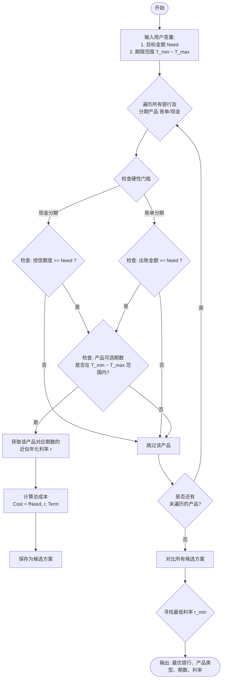

# 信用卡借款成本计算器 - 产品需求文档 (PRD)

## 1. 项目概述

### 1.1 项目背景

为用户提供一个便捷的信用卡借款成本计算工具，帮助用户在多银行信用卡中选择最优的融资方案，降低借款成本。

### 1.2 项目目标

- 展示用户所有银行信用卡的账单和授信情况
- 根据用户借款需求计算最优融资成本方案
- 提供后端数据管理功能

### 1.3 技术方案

- **前端技术**: 纯HTML/CSS/JavaScript（无框架）
- **后端技术**: 复用现有项目后端架构（Node.js）
- **数据存储**: 数据库存储，后端提供API接口
- **数据管理**: 独立的后端管理界面
- **前端-后端交互**: 前端通过API调用获取和提交数据
- **适配**: 手机H5响应式设计
- **UI风格**: 简洁现代的金融风格

***

## 2. 功能需求

### 2.1 核心功能模块

#### 2.1.1 Tab 1 - 信用卡信息展示

**功能描述**：展示用户所有银行信用卡的账单出账金额和现金授信额度

**功能点**：

- 按银行卡片形式展示
- 显示银行名称、logo（可选）
- 显示账单出账金额
- 显示现金授信额度
- 支持刷新数据

#### 2.1.2 Tab 2 - 最优融资方案计算

**功能描述**：在客户所需的借款金额和希望的偿还期数下，找到银行所有分期产品最低的年化利率，然后根据该产品的最高办理金额上限，依次匹配客户的借款需求

**功能点**：

- 输入：目标借款金额
  - 支持手动输入
  - 提供"一键填入当前总负债"按钮，自动计算并填入所有信用卡账单出账金额的总和
- 输入：借款期数范围（最小期数 \~ 最大期数）
- 计算：
  1. 筛选符合期数条件的所有分期产品
  2. 按年化利率从低到高排序所有产品
  3. 根据每个产品的最高办理金额上限，依次匹配客户借款需求
  4. 支持组合使用多家银行的产品
- 输出：最优融资方案组合
  - 列出所有使用的产品（按利率从低到高排序）
  - 每个产品的银行名称、产品类型、期数、年化利率、借款金额、利息
  - 总计：总借款金额、综合年化利率、总利息

***

**计算结果展示设计**

```
┌─────────────────────────────────────────────────────────────┐
│                  📊 最优融资方案组合                      │
├─────────────────────────────────────────────────────────────┤
│                                                             │
│  ┌─────────────────────────────────────────────────────┐  │
│  │  1. 招商银行 - 现金分期                    [最优]    │  │
│  │  ─────────────────────────────────────────────────  │  │
│  │  借款金额: ¥50,000.00  │  期数: 12期            │  │
│  │  年化利率: 4.50%      │  利息: ¥1,235.42      │  │
│  └─────────────────────────────────────────────────────┘  │
│                                                             │
│  ┌─────────────────────────────────────────────────────┐  │
│  │  2. 工商银行 - 现金分期                             │  │
│  │  ─────────────────────────────────────────────────  │  │
│  │  借款金额: ¥40,000.00  │  期数: 12期            │  │
│  │  年化利率: 4.80%      │  利息: ¥1,045.20      │  │
│  └─────────────────────────────────────────────────────┘  │
│                                                             │
│  ┌─────────────────────────────────────────────────────┐  │
│  │  3. 建设银行 - 现金分期                             │  │
│  │  ─────────────────────────────────────────────────  │  │
│  │  借款金额: ¥10,000.00  │  期数: 12期            │  │
│  │  年化利率: 5.20%      │  利息: ¥283.40        │  │
│  └─────────────────────────────────────────────────────┘  │
│                                                             │
├─────────────────────────────────────────────────────────────┤
│  📈 方案汇总                                             │
├─────────────────────────────────────────────────────────────┤
│                                                             │
│  总借款金额: ¥100,000.00                                 │
│  综合年化利率: 4.68%                                       │
│  总利息: ¥2,564.02                                        │
│  总月供: ¥8,547.00                                        │
│                                                             │
└─────────────────────────────────────────────────────────────┘
```

***

**示例1：1家银行即可覆盖需求**

场景：客户目标借款金额=5000元（所有账单金额总和），借钱期数在12期-12期之间

条件：

- A银行的现金分期授信额度=5万元（≥5000元）
- A银行12期现金分期利率在符合条件的产品中最低

最优方案：A银行现金分期，借款5000元，12期

***

**示例2：需要多家银行才能覆盖客户借款需求**

场景：客户目标借款金额=10万元，且本期没有账单

条件：

- A银行现金授信额度=5万元，利率最低
- B银行现金授信额度=4万元，利率次低
- C银行现金授信额度=4万元，利率最高

最优方案：

1. A银行现金分期，借款5万元
2. B银行现金分期，借款4万元
3. C银行现金分期，借款1万元
   总计：10万元

***

**示例3：现金分期和账单分期的互相偿还**

场景：客户目标借款金额=7万元

- A银行账单=1万元
- B银行账单=2万元
- 剩余现金需求=4万元

条件：

- A银行现金授信额度=5万元
- B银行现金授信额度=4万元
- 利率排名：A银行账单利率 < A银行现金利率 < B银行现金利率 < B银行账单利率

最优方案：

1. A银行账单分期：还账单1万元（必须优先还自己的账单）
2. A银行现金分期：借款5万元（其中1万元拿来还B银行账单）
3. B银行账单分期：还账单1万元（剩余的1万元账单）
   总计：7万元

<br />

<br />

#### 2.1.3 后端管理界面

**功能描述**：独立的后端管理界面，用于管理信用卡数据和产品利率数据

**功能点**：

- 信用卡数据管理
  - 添加/编辑/删除银行信用卡信息
  - 设置账单出账金额
  - 设置现金授信额度
- 产品利率数据管理
  - 添加/编辑/删除分期产品信息
  - 设置期数选项
  - 设置对应期数的年化利率
  - 设置最低/最高借款金额门槛
- 数据持久化：所有数据存储在数据库中

#### 2.1.4 后端API接口

**功能描述**：后端提供RESTful API接口，供前端调用

**功能点**：

- GET /api/credit-cards - 获取所有信用卡数据
- GET /api/credit-cards/:id - 获取单个信用卡数据
- POST /api/credit-cards - 新增信用卡（后端管理使用）
- PUT /api/credit-cards/:id - 更新信用卡（后端管理使用）
- DELETE /api/credit-cards/:id - 删除信用卡（后端管理使用）
- POST /api/calculate - 提交计算请求，返回最优方案

***

## 3. 数据结构设计

### 3.1 数据库表设计

#### 3.1.1 信用卡表 (credit\_cards)

存储用户的信用卡基本信息

| 字段名           | 类型            | 说明         | 示例       |
| ------------- | ------------- | ---------- | -------- |
| id            | INT           | 主键，自增      | 1        |
| bank\_name    | VARCHAR(100)  | 银行名称       | 招商银行     |
| bank\_logo    | VARCHAR(255)  | 银行logo URL | <br />   |
| bill\_amount  | DECIMAL(10,2) | 账单出账金额     | 15000.00 |
| credit\_limit | DECIMAL(10,2) | 现金授信额度     | 50000.00 |
| created\_at   | DATETIME      | 创建时间       | <br />   |
| updated\_at   | DATETIME      | 更新时间       | <br />   |

#### 3.1.2 分期产品表 (installment\_products)

存储各银行的分期产品配置

| 字段名              | 类型            | 说明                         | 示例       |
| ---------------- | ------------- | -------------------------- | -------- |
| id               | INT           | 主键，自增                      | 1        |
| credit\_card\_id | INT           | 关联的信用卡ID                   | 1        |
| product\_type    | ENUM          | 产品类型：bill(账单分期)/cash(现金分期) | bill     |
| enabled          | BOOLEAN       | 是否启用                       | true     |
| term             | INT           | 期数（月）                      | 3        |
| rate             | DECIMAL(5,4)  | 年化利率（小数形式）                 | 0.0450   |
| min\_amount      | DECIMAL(10,2) | 最低借款金额                     | 1000.00  |
| max\_amount      | DECIMAL(10,2) | 最高借款金额                     | 50000.00 |
| created\_at      | DATETIME      | 创建时间                       | <br />   |
| updated\_at      | DATETIME      | 更新时间                       | <br />   |

### 3.2 JSON数据示例（供参考）

```json
{
  "creditCards": [
    {
      "id": "bank_001",
      "bankName": "招商银行",
      "bankLogo": "",
      "billAmount": 15000,
      "creditLimit": 50000,
      "products": {
        "billInstallment": {
          "enabled": true,
          "terms": [
            { "term": 3, "rate": 0.045, "minAmount": 1000, "maxAmount": 50000 },
            { "term": 6, "rate": 0.042, "minAmount": 1000, "maxAmount": 50000 },
            { "term": 12, "rate": 0.048, "minAmount": 1000, "maxAmount": 50000 }
          ]
        },
        "cashInstallment": {
          "enabled": true,
          "terms": [
            { "term": 3, "rate": 0.052, "minAmount": 1000, "maxAmount": 50000 },
            { "term": 6, "rate": 0.049, "minAmount": 1000, "maxAmount": 50000 },
            { "term": 12, "rate": 0.055, "minAmount": 1000, "maxAmount": 50000 }
          ]
        }
      }
    }
  ]
}
```

**字段说明**：

- `id`: 唯一标识
- `bankName`: 银行名称
- `bankLogo`: 银行logo（可选）
- `billAmount`: 账单出账金额
- `creditLimit`: 现金授信额度
- `products`: 分期产品配置
  - `billInstallment`: 账单分期
  - `cashInstallment`: 现金分期
  - `terms`: 期数配置数组
    - `term`: 期数（月）
    - `rate`: 年化利率（小数形式）
    - `minAmount`: 最低借款金额
    - `maxAmount`: 最高借款金额

***

## 4. 业务流程

### 4.1 最优方案计算流程



### 4.2 成本计算公式

**等本等息还款方式**：

1. **每月还款额** = (借款本金 × 月利率 × (1 + 月利率) ^ 期数) / ((1 + 月利率) ^ 期数 - 1)
   - 月利率 = 年利率 / 12
2. **总利息** = 每月还款额 × 期数 - 借款本金
3. **总成本** = 总利息

***

## 5. 界面设计

### 5.1 页面结构

```
┌─────────────────────────────┐
│      信用卡借款计算器        │
├─────────────────────────────┤
│  [信用卡列表]  [计算最优]   │  ← Tab导航
├─────────────────────────────┤
│                             │
│   Tab 1: 信用卡列表        │
│   - 银行卡片1               │
│   - 银行卡片2               │
│   - ...                     │
│                             │
│   Tab 2: 计算最优方案      │
│   - 输入借款金额            │
│   - [一键填入]按钮          │
│   - 选择期数范围            │
│   - [计算]按钮              │
│   - 结果展示区域            │
│                             │
└─────────────────────────────┘
```

### 5.2 Tab 1 - 信用卡列表界面

**设计要点**：

- 卡片式布局，每张卡代表一家银行
- 突出显示账单金额和授信额度
- 颜色区分：账单金额用橙色/红色，授信额度用绿色
- 简洁的图标和文字

### 5.3 Tab 2 - 最优方案计算界面

**设计要点**：

- 输入区域：简洁的表单设计
  - 借款金额输入框
  - \[一键填入所有出账金额]按钮（位于输入框旁，点击后自动计算并填充所有信用卡账单出账金额的总和）
  - 最小期数选择器
  - 最大期数选择器
- 计算按钮：醒目突出
- 结果展示：
  - 最优方案卡片（高亮显示）
  - 年化利率大字展示
  - 详细还款计划

### 5.4 后端管理界面

**设计要点**：

- 独立的后台管理页面
- 分两个标签页：信用卡管理、分期产品管理
- 表单形式编辑数据
- 列表视图展示所有数据
- 支持新增、编辑、删除操作

***

## 6. 项目文件结构

```
credit-calculator/
├── PRD.md                         # 本文档
├── frontend/                      # 前端H5页面
│   ├── index.html                # 主页面
│   ├── css/
│   │   └── style.css             # 样式文件
│   └── js/
│       ├── app.js                # 主应用逻辑
│       ├── calculator.js         # 计算引擎
│       ├── api.js                # API接口调用
│       └── ui.js                 # UI交互
└── backend/                       # 后端管理（复用现有架构）
    ├── admin.html                # 后端管理页面
    └── (集成到现有后端服务)
```

***

## 7. 优先级规划

### 7.1 第一阶段（MVP）

- [ ] 后端数据库表设计和API接口开发
- [ ] 项目基础结构搭建
- [ ] 前端Tab 1 - 信用卡列表展示（通过API获取数据）
- [ ] 前端Tab 2 - 计算功能实现（核心算法 + 一键填入按钮）
- [ ] 基础UI样式（手机H5适配）

### 7.2 第二阶段

- [ ] 后端管理界面开发
- [ ] 结果详情展示（每月还款计划）
- [ ] 优化用户体验和动画效果

### 7.3 第三阶段（可选）

- [ ] 多方案对比展示
- [ ] 历史计算记录
- [ ] 银行logo支持
- [ ] 主题切换

***

## 8. 假设与约束

### 8.1 假设

- 现金分期和账单分期可以互相通用（借现金还账单等场景）
- 用户输入的借款金额在合理范围内
- 所有银行产品数据准确无误

### 8.2 约束

- 前端通过API调用后端获取数据
- 数据持久化存储在数据库中
- 不涉及真实的金融交易，仅作计算参考
- 计算结果仅供参考，实际以银行为准

