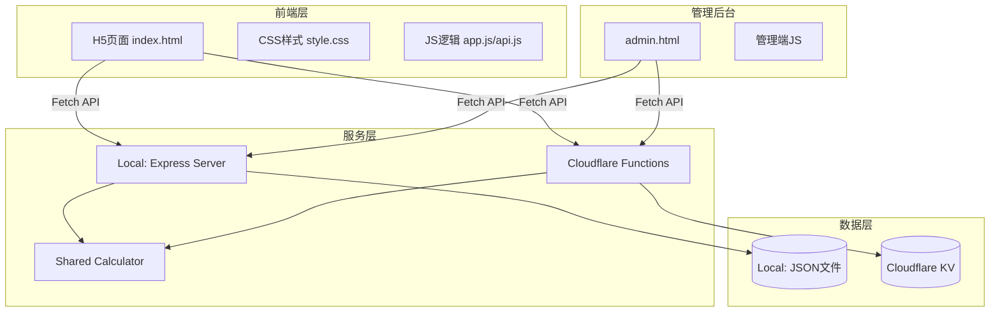

# 信用卡借款成本计算器 - 技术文档

## 1. 技术栈选型

基于当前最成熟的技术栈，结合项目需求，选择以下技术方案：

| 类别 | 技术选型 | 版本/说明 | 选型理由 |
|------|----------|-----------|----------|
| **后端框架** | Node.js + Express | LTS版本 | 成熟稳定、生态完善、适合本地开发 |
| **服务端部署** | Cloudflare Pages Functions | 最新 | 无服务器架构、自动扩缩容、成本低 |
| **数据存储** | JSON文件（本地）/ Cloudflare KV（生产） | - | 轻量级、无需数据库服务、易于维护 |
| **前端技术** | 原生 HTML5/CSS3/ES6+ | 无框架 | 轻量快速、无需构建工具、便于维护 |
| **UI组件库** | 原生实现 + 自定义 | - | 保持简洁、减少依赖 |
| **响应式框架** | CSS Flexbox + Grid + Media Queries | - | 原生支持、性能最佳 |
| **数据交互** | Fetch API | 原生 | 现代浏览器原生支持 |
| **开发工具** | nodemon / wrangler | - | 开发时自动重启服务 |

---

## 2. 项目架构设计

### 2.1 整体架构



### 2.2 目录结构

```
credit-calculator/
├── src/                      # 共享源代码
│   ├── frontend/             # 前端H5页面
│   │   ├── index.html        # 主页面
│   │   ├── css/
│   │   │   └── style.css     # 样式文件
│   │   └── js/
│   │       ├── app.js        # 主应用入口
│   │       └── api.js        # API接口封装
│   ├── admin/                # 管理后台
│   │   └── index.html        # 管理页面
│   └── shared/               # 共享业务逻辑
│       └── calculator.js     # 计算引擎
├── cloudflare/               # Cloudflare Pages 专用
│   └── functions/            # Pages Functions API
│       ├── _middleware.js
│       └── api/
│           ├── calculate.js
│           └── credit-cards/
│               ├── index.js
│               └── [id].js
├── local/                    # 本地开发专用
│   ├── server.js             # Express 服务器
│   └── data/                 # 本地数据文件
│       ├── data.json
│       └── sample-data.json
├── prd/                      # 文档
├── DEPLOYMENT.md             # 部署指南
├── wrangler.toml             # Cloudflare 配置
└── package.json              # 依赖配置
```

### 2.3 架构说明

| 模块 | 职责 | 运行环境 |
|------|------|----------|
| `src/frontend` | 用户前端页面，展示信用卡信息和计算结果 | 浏览器 |
| `src/admin` | 管理后台，管理信用卡和分期产品数据 | 浏览器 |
| `src/shared` | 共享的业务逻辑（计算引擎） | Node.js |
| `cloudflare/functions` | Cloudflare Pages Functions API | Cloudflare |
| `local/server.js` | Express 服务器（本地开发） | 本地 Node.js |
| `local/data` | JSON 数据文件（本地开发） | 本地文件系统 |

---

## 3. 数据结构设计

### 3.1 JSON数据结构

```json
{
  "creditCards": [
    {
      "id": "bank_001",
      "bankName": "招商银行",
      "bankLogo": "",
      "billAmount": 15000,
      "creditLimit": 50000,
      "products": [
        {
          "id": "prod_001",
          "productType": "bill",
          "enabled": true,
          "term": 3,
          "rate": 0.045,
          "billAmount": 15000
        },
        {
          "id": "prod_002",
          "productType": "cash",
          "enabled": true,
          "term": 3,
          "rate": 0.052,
          "minAmount": 1000,
          "maxAmount": 50000
        }
      ]
    }
  ]
}
```

### 3.2 字段说明

#### 信用卡对象 (creditCards)

| 字段 | 类型 | 说明 | 示例 |
|------|------|------|------|
| id | string | 唯一标识 | "bank_001" |
| bankName | string | 银行名称 | "招商银行" |
| bankLogo | string | 银行logo URL（可选） | "" |
| billAmount | number | 账单出账金额 | 15000 |
| creditLimit | number | 现金授信额度 | 50000 |
| products | array | 分期产品列表 | [...] |

#### 分期产品对象 (products)

| 字段 | 类型 | 说明 | 适用产品 |
|------|------|------|----------|
| id | string | 产品唯一标识 | 全部 |
| productType | string | 产品类型：bill/cash | 全部 |
| enabled | boolean | 是否启用 | 全部 |
| term | number | 期数（月） | 全部 |
| rate | number | 年化利率（小数形式） | 全部 |
| billAmount | number | 账单分期金额 | 账单分期 |
| minAmount | number | 最低借款金额（默认1000） | 现金分期 |
| maxAmount | number | 最高借款金额 | 现金分期 |

---

## 4. API 接口设计

### 4.1 统一响应格式

```json
{
  "code": 0,
  "message": "success",
  "data": {}
}
```

| 字段 | 类型 | 说明 |
|------|------|------|
| code | int | 状态码，0表示成功，非0表示错误 |
| message | string | 响应消息 |
| data | object/array | 响应数据 |

### 4.2 信用卡管理 API

#### 4.2.1 获取所有信用卡

```
GET /api/credit-cards
```

**响应示例**:

```json
{
  "code": 0,
  "message": "success",
  "data": [
    {
      "id": "bank_001",
      "bankName": "招商银行",
      "bankLogo": "",
      "billAmount": 15000,
      "creditLimit": 50000,
      "products": [
        {
          "id": "prod_001",
          "productType": "bill",
          "enabled": true,
          "term": 3,
          "rate": 0.045,
          "billAmount": 15000
        }
      ]
    }
  ]
}
```

#### 4.2.2 获取单个信用卡详情

```
GET /api/credit-cards/:id
```

#### 4.2.3 创建信用卡

```
POST /api/credit-cards
```

**请求体**:

```json
{
  "bankName": "招商银行",
  "bankLogo": "",
  "billAmount": 15000,
  "creditLimit": 50000
}
```

#### 4.2.4 更新信用卡

```
PUT /api/credit-cards/:id
```

**请求体**: 同创建

#### 4.2.5 删除信用卡

```
DELETE /api/credit-cards/:id
```

### 4.3 计算 API

#### 4.3.1 计算最优方案

```
POST /api/calculate
```

**请求体**:

```json
{
  "amount": 20000,
  "term": 12
}
```

| 字段 | 类型 | 说明 |
|------|------|------|
| amount | number | 目标借款金额 |
| term | number | 借款期数（月） |

**响应示例**:

```json
{
  "code": 0,
  "message": "success",
  "data": {
    "options": [
      {
        "creditCardId": "bank_001",
        "bankName": "招商银行",
        "productType": "bill",
        "productTypeName": "账单分期",
        "term": 12,
        "rate": 0.045,
        "borrowAmount": 15000,
        "monthlyPayment": 1290.55,
        "totalInterest": 486.60,
        "totalCost": 486.60
      },
      {
        "creditCardId": "bank_002",
        "bankName": "工商银行",
        "productType": "cash",
        "productTypeName": "现金分期",
        "term": 12,
        "rate": 0.048,
        "borrowAmount": 5000,
        "monthlyPayment": 432.06,
        "totalInterest": 184.72,
        "totalCost": 184.72
      }
    ],
    "total": {
      "borrowAmount": 20000,
      "weightedRate": 0.0457,
      "totalInterest": 671.32,
      "totalMonthlyPayment": 1722.61
    }
  }
}
```

---

## 5. 核心算法实现

### 5.1 等本等息还款计算

#### 5.1.1 计算公式

```javascript
/**
 * 计算等本等息还款（支持0利率特殊处理）
 * @param {number} principal - 借款本金
 * @param {number} annualRate - 年化利率（小数形式，如 0.045）
 * @param {number} term - 期数（月）
 * @returns {Object} 计算结果
 */
function calculateEqualPayment(principal, annualRate, term) {
  let monthlyPayment, totalPayment, totalInterest;
  
  if (annualRate === 0) {
    monthlyPayment = principal / term;
    totalPayment = principal;
    totalInterest = 0;
  } else {
    const monthlyRate = annualRate / 12;
    monthlyPayment = principal * monthlyRate * Math.pow(1 + monthlyRate, term) / 
                   (Math.pow(1 + monthlyRate, term) - 1);
    totalPayment = monthlyPayment * term;
    totalInterest = totalPayment - principal;
  }
  
  return {
    principal,
    annualRate,
    term,
    monthlyRate: annualRate / 12,
    monthlyPayment: Math.round(monthlyPayment * 100) / 100,
    totalPayment: Math.round(totalPayment * 100) / 100,
    totalInterest: Math.round(totalInterest * 100) / 100,
    totalCost: Math.round(totalInterest * 100) / 100
  };
}
```

### 5.2 最优方案筛选算法

```javascript
/**
 * 筛选最优借款方案（支持多家银行组合）
 * @param {Array} creditCards - 信用卡列表
 * @param {number} amount - 需要借款的总金额
 * @param {number} term - 借款期数
 * @returns {Object} 最优方案组合及汇总信息
 */
function findBestOption(creditCards, amount, term) {
  // 1. 筛选符合期数条件的所有产品
  const validProducts = [];
  for (const card of creditCards) {
    for (const product of card.products) {
      if (!product.enabled) continue;
      
      // 检查期数是否匹配
      if (product.term !== term) continue;
      
      validProducts.push({
        ...product,
        creditCardId: card.id,
        bankName: card.bankName
      });
    }
  }
  
  // 2. 按年化利率从低到高排序
  validProducts.sort((a, b) => a.rate - b.rate);
  
  // 3. 依次匹配，凑够总借款金额
  let remainingAmount = amount;
  const selectedOptions = [];
  
  for (const product of validProducts) {
    if (remainingAmount <= 0) break;
    
    // 确定该产品可借的金额
    let borrowAmount = 0;
    if (product.productType === 'bill') {
      borrowAmount = Math.min(Number(product.billAmount), remainingAmount);
    } else {
      borrowAmount = Math.min(Number(product.maxAmount), remainingAmount);
      if (borrowAmount < Number(product.minAmount)) {
        continue;
      }
    }
    
    if (borrowAmount <= 0) continue;
    
    // 计算该产品的成本
    const costResult = calculateEqualPayment(borrowAmount, Number(product.rate), product.term);
    
    selectedOptions.push({
      creditCardId: product.creditCardId,
      bankName: product.bankName,
      productType: product.productType,
      productTypeName: product.productType === 'bill' ? '账单分期' : '现金分期',
      term: product.term,
      rate: Number(product.rate),
      borrowAmount: borrowAmount,
      ...costResult
    });
    
    remainingAmount -= borrowAmount;
  }
  
  // 4. 计算汇总信息
  let totalBorrowAmount = 0;
  let totalInterest = 0;
  let totalMonthlyPayment = 0;
  let weightedRateSum = 0;
  
  for (const option of selectedOptions) {
    totalBorrowAmount += option.borrowAmount;
    totalInterest += option.totalInterest;
    totalMonthlyPayment += option.monthlyPayment;
    weightedRateSum += option.rate * option.borrowAmount;
  }
  
  const weightedRate = totalBorrowAmount > 0 ? weightedRateSum / totalBorrowAmount : 0;
  
  return {
    options: selectedOptions,
    total: {
      borrowAmount: totalBorrowAmount,
      weightedRate: weightedRate,
      totalInterest: totalInterest,
      totalMonthlyPayment: totalMonthlyPayment
    }
  };
}
```

### 5.3 一键填入账单总额

```javascript
/**
 * 计算所有信用卡账单出账金额的总和
 * @param {Array} creditCards - 信用卡列表
 * @returns {number} 账单总额
 */
function calculateTotalBillAmount(creditCards) {
  return creditCards.reduce((sum, card) => sum + Number(card.billAmount), 0);
}
```

---

## 6. 前端架构设计

### 6.1 API 封装 (api.js)

```javascript
const API_BASE = '/api';

class ApiClient {
  constructor(baseUrl = API_BASE) {
    this.baseUrl = baseUrl;
  }
  
  async request(endpoint, options = {}) {
    const url = `${this.baseUrl}${endpoint}`;
    const config = {
      headers: {
        'Content-Type': 'application/json',
        ...options.headers
      },
      ...options
    };
    
    try {
      const response = await fetch(url, config);
      const data = await response.json();
      
      if (data.code !== 0) {
        throw new Error(data.message || '请求失败');
      }
      
      return data.data;
    } catch (error) {
      console.error('API Error:', error);
      throw error;
    }
  }
  
  // 信用卡相关
  async getCreditCards() {
    return this.request('/credit-cards');
  }
  
  async getCreditCard(id) {
    return this.request(`/credit-cards/${id}`);
  }
  
  async createCreditCard(data) {
    return this.request('/credit-cards', {
      method: 'POST',
      body: JSON.stringify(data)
    });
  }
  
  async updateCreditCard(id, data) {
    return this.request(`/credit-cards/${id}`, {
      method: 'PUT',
      body: JSON.stringify(data)
    });
  }
  
  async deleteCreditCard(id) {
    return this.request(`/credit-cards/${id}`, {
      method: 'DELETE'
    });
  }
  
  // 计算相关
  async calculate(amount, term) {
    return this.request('/calculate', {
      method: 'POST',
      body: JSON.stringify({ amount, term })
    });
  }
}

export const api = new ApiClient();
```

### 6.2 前端应用逻辑 (app.js)

```javascript
class App {
  constructor() {
    this.state = {
      creditCards: [],
      currentTab: 'cards',
      calculateResult: null,
      loading: false
    };
    this.init();
  }
  
  async init() {
    await this.loadCreditCards();
    this.bindEvents();
    this.render();
  }
  
  async loadCreditCards() {
    try {
      this.state.loading = true;
      this.state.creditCards = await api.getCreditCards();
    } catch (error) {
      console.error('加载信用卡数据失败:', error);
    } finally {
      this.state.loading = false;
    }
  }
  
  switchTab(tab) {
    this.state.currentTab = tab;
    this.render();
  }
  
  async handleCalculate(amount, term) {
    try {
      this.state.loading = true;
      this.state.calculateResult = await api.calculate(amount, term);
      this.render();
    } catch (error) {
      console.error('计算失败:', error);
    } finally {
      this.state.loading = false;
    }
  }
  
  getTotalBillAmount() {
    return this.state.creditCards.reduce((sum, card) => sum + Number(card.billAmount), 0);
  }
  
  bindEvents() {
    // Tab 切换
    document.querySelectorAll('.tab-btn').forEach(btn => {
      btn.addEventListener('click', () => {
        this.switchTab(btn.dataset.tab);
      });
    });
    
    // 计算按钮
    document.getElementById('calculate-btn')?.addEventListener('click', () => {
      const amount = parseFloat(document.getElementById('amount-input').value);
      const term = parseInt(document.getElementById('term-input').value);
      this.handleCalculate(amount, term);
    });
    
    // 一键填入按钮
    document.getElementById('fill-bill-btn')?.addEventListener('click', () => {
      const total = this.getTotalBillAmount();
      document.getElementById('amount-input').value = total;
    });
  }
  
  render() {
    this.renderTabs();
    this.renderCardsList();
    this.renderCalculateResult();
  }
  
  renderTabs() {
    document.querySelectorAll('.tab-btn').forEach(btn => {
      btn.classList.toggle('active', btn.dataset.tab === this.state.currentTab);
    });
    document.querySelectorAll('.tab-content').forEach(content => {
      content.classList.toggle('active', content.id === `${this.state.currentTab}-tab`);
    });
  }
  
  renderCardsList() {
    const container = document.getElementById('cards-container');
    if (!container) return;
    
    if (this.state.loading) {
      container.innerHTML = '<div class="loading">加载中...</div>';
      return;
    }
    
    container.innerHTML = this.state.creditCards.map(card => `
      <div class="credit-card">
        <div class="card-header">
          <span class="bank-name">${card.bankName}</span>
        </div>
        <div class="card-body">
          <div class="info-item">
            <span class="label">账单出账金额</span>
            <span class="value bill-amount">¥${card.billAmount.toFixed(2)}</span>
          </div>
          <div class="info-item">
            <span class="label">现金授信额度</span>
            <span class="value credit-limit">¥${card.creditLimit.toFixed(2)}</span>
          </div>
        </div>
      </div>
    `).join('');
  }
  
  renderCalculateResult() {
    const container = document.getElementById('result-container');
    if (!container || !this.state.calculateResult) return;
    
    const { options, total } = this.state.calculateResult;
    
    if (!options || options.length === 0) {
      container.innerHTML = '<div class="no-result">暂无符合条件的方案</div>';
      return;
    }
    
    const optionsHtml = options.map((option, index) => `
      <div class="result-card ${index === 0 ? 'best-option' : ''}">
        <div class="result-header">
          <span class="option-number">${index + 1}.</span>
          <span class="bank-name">${option.bankName}</span>
          <span class="product-type">${option.productTypeName}</span>
          ${index === 0 ? '<span class="badge">最优</span>' : ''}
        </div>
        <div class="result-body">
          <div class="result-row">
            <span class="label">借款金额</span>
            <span class="value">¥${option.borrowAmount.toFixed(2)}</span>
            <span class="label">期数</span>
            <span class="value">${option.term}期</span>
          </div>
          <div class="result-row">
            <span class="label">年化利率</span>
            <span class="value rate">${(option.rate * 100).toFixed(2)}%</span>
            <span class="label">利息</span>
            <span class="value interest">¥${option.totalInterest.toFixed(2)}</span>
          </div>
        </div>
      </div>
    `).join('');
    
    const totalHtml = `
      <div class="result-summary">
        <div class="summary-header">📈 方案汇总</div>
        <div class="summary-grid">
          <div class="summary-item">
            <span class="label">总借款金额</span>
            <span class="value">¥${total.borrowAmount.toFixed(2)}</span>
          </div>
          <div class="summary-item">
            <span class="label">综合年化利率</span>
            <span class="value">${(total.weightedRate * 100).toFixed(2)}%</span>
          </div>
          <div class="summary-item">
            <span class="label">总利息</span>
            <span class="value">¥${total.totalInterest.toFixed(2)}</span>
          </div>
          <div class="summary-item">
            <span class="label">总月供</span>
            <span class="value">¥${total.totalMonthlyPayment.toFixed(2)}</span>
          </div>
        </div>
      </div>
    `;
    
    container.innerHTML = `
      <div class="result-section">
        <h3 class="result-title">📊 最优融资方案组合</h3>
        <div class="options-container">${optionsHtml}</div>
        ${totalHtml}
      </div>
    `;
  }
}

document.addEventListener('DOMContentLoaded', () => {
  window.app = new App();
});
```

---

## 7. 后端实现

### 7.1 本地开发服务器 (local/server.js)

```javascript
const express = require('express');
const path = require('path');
const cors = require('cors');
const fs = require('fs');

const app = express();
const PORT = process.env.PORT || 3000;

// 中间件
app.use(cors());
app.use(express.json());
app.use(express.static(path.join(__dirname, '../src/frontend')));
app.use('/admin', express.static(path.join(__dirname, '../src/admin')));

// 数据文件路径
const DATA_FILE = path.join(__dirname, 'data/data.json');
const SAMPLE_FILE = path.join(__dirname, 'sample-data.json');

// 初始化数据
function initData() {
  if (!fs.existsSync(DATA_FILE)) {
    fs.copyFileSync(SAMPLE_FILE, DATA_FILE);
  }
}

// 读取数据
function getData() {
  initData();
  const data = fs.readFileSync(DATA_FILE, 'utf8');
  return JSON.parse(data);
}

// 保存数据
function saveData(data) {
  fs.writeFileSync(DATA_FILE, JSON.stringify(data, null, 2));
}

// API 路由
// 获取所有信用卡
app.get('/api/credit-cards', (req, res) => {
  const data = getData();
  res.json({ code: 0, message: 'success', data: data.creditCards });
});

// 获取单个信用卡
app.get('/api/credit-cards/:id', (req, res) => {
  const data = getData();
  const card = data.creditCards.find(c => c.id === req.params.id);
  if (card) {
    res.json({ code: 0, message: 'success', data: card });
  } else {
    res.json({ code: 1, message: '信用卡不存在', data: null });
  }
});

// 创建信用卡
app.post('/api/credit-cards', (req, res) => {
  const data = getData();
  const newCard = {
    id: `bank_${Date.now()}`,
    bankName: req.body.bankName || '',
    bankLogo: req.body.bankLogo || '',
    billAmount: Number(req.body.billAmount) || 0,
    creditLimit: Number(req.body.creditLimit) || 0,
    products: []
  };
  data.creditCards.push(newCard);
  saveData(data);
  res.json({ code: 0, message: '创建成功', data: newCard });
});

// 更新信用卡
app.put('/api/credit-cards/:id', (req, res) => {
  const data = getData();
  const index = data.creditCards.findIndex(c => c.id === req.params.id);
  if (index !== -1) {
    data.creditCards[index] = {
      ...data.creditCards[index],
      ...req.body,
      id: req.params.id
    };
    saveData(data);
    res.json({ code: 0, message: '更新成功', data: data.creditCards[index] });
  } else {
    res.json({ code: 1, message: '信用卡不存在', data: null });
  }
});

// 删除信用卡
app.delete('/api/credit-cards/:id', (req, res) => {
  const data = getData();
  const index = data.creditCards.findIndex(c => c.id === req.params.id);
  if (index !== -1) {
    const deleted = data.creditCards.splice(index, 1)[0];
    saveData(data);
    res.json({ code: 0, message: '删除成功', data: deleted });
  } else {
    res.json({ code: 1, message: '信用卡不存在', data: null });
  }
});

// 计算最优方案
app.post('/api/calculate', (req, res) => {
  const { amount, term } = req.body;
  
  if (!amount || !term) {
    return res.json({ code: 1, message: '请填写完整的计算参数', data: null });
  }
  
  const data = getData();
  const result = findBestOption(data.creditCards, amount, term);
  
  res.json({ code: 0, message: 'success', data: result });
});

// 计算函数
function calculateEqualPayment(principal, annualRate, term) {
  let monthlyPayment, totalPayment, totalInterest;
  
  if (annualRate === 0) {
    monthlyPayment = principal / term;
    totalPayment = principal;
    totalInterest = 0;
  } else {
    const monthlyRate = annualRate / 12;
    monthlyPayment = principal * monthlyRate * Math.pow(1 + monthlyRate, term) / 
                   (Math.pow(1 + monthlyRate, term) - 1);
    totalPayment = monthlyPayment * term;
    totalInterest = totalPayment - principal;
  }
  
  return {
    principal,
    annualRate,
    term,
    monthlyRate: annualRate / 12,
    monthlyPayment: Math.round(monthlyPayment * 100) / 100,
    totalPayment: Math.round(totalPayment * 100) / 100,
    totalInterest: Math.round(totalInterest * 100) / 100,
    totalCost: Math.round(totalInterest * 100) / 100
  };
}

function findBestOption(creditCards, amount, term) {
  const validProducts = [];
  for (const card of creditCards) {
    for (const product of card.products) {
      if (!product.enabled) continue;
      if (product.term !== term) continue;
      
      validProducts.push({
        ...product,
        creditCardId: card.id,
        bankName: card.bankName
      });
    }
  }
  
  validProducts.sort((a, b) => a.rate - b.rate);
  
  let remainingAmount = amount;
  const selectedOptions = [];
  
  for (const product of validProducts) {
    if (remainingAmount <= 0) break;
    
    let borrowAmount = 0;
    if (product.productType === 'bill') {
      borrowAmount = Math.min(Number(product.billAmount), remainingAmount);
    } else {
      borrowAmount = Math.min(Number(product.maxAmount), remainingAmount);
      if (borrowAmount < Number(product.minAmount)) {
        continue;
      }
    }
    
    if (borrowAmount <= 0) continue;
    
    const costResult = calculateEqualPayment(borrowAmount, Number(product.rate), product.term);
    
    selectedOptions.push({
      creditCardId: product.creditCardId,
      bankName: product.bankName,
      productType: product.productType,
      productTypeName: product.productType === 'bill' ? '账单分期' : '现金分期',
      term: product.term,
      rate: Number(product.rate),
      borrowAmount: borrowAmount,
      ...costResult
    });
    
    remainingAmount -= borrowAmount;
  }
  
  let totalBorrowAmount = 0;
  let totalInterest = 0;
  let totalMonthlyPayment = 0;
  let weightedRateSum = 0;
  
  for (const option of selectedOptions) {
    totalBorrowAmount += option.borrowAmount;
    totalInterest += option.totalInterest;
    totalMonthlyPayment += option.monthlyPayment;
    weightedRateSum += option.rate * option.borrowAmount;
  }
  
  const weightedRate = totalBorrowAmount > 0 ? weightedRateSum / totalBorrowAmount : 0;
  
  return {
    options: selectedOptions,
    total: {
      borrowAmount: totalBorrowAmount,
      weightedRate: weightedRate,
      totalInterest: totalInterest,
      totalMonthlyPayment: totalMonthlyPayment
    }
  };
}

// 启动服务
app.listen(PORT, () => {
  initData();
  console.log(`服务器运行在 http://localhost:${PORT}`);
});
```

---

## 8. Cloudflare Functions 实现

### 8.1 计算接口 (cloudflare/functions/api/calculate.js)

```javascript
export async function onRequestPost(context) {
  const { amount, term } = await context.request.json();
  
  if (!amount || !term) {
    return new Response(JSON.stringify({ code: 1, message: '请填写完整的计算参数', data: null }), {
      headers: { 'Content-Type': 'application/json' },
    });
  }
  
  const data = await getData(context.env);
  const result = findBestOption(data.creditCards, amount, term);
  
  return new Response(JSON.stringify({ code: 0, message: 'success', data: result }), {
    headers: { 'Content-Type': 'application/json' },
  });
}

async function getData(env) {
  try {
    const data = await env.DATA_KV.get('data');
    if (data) {
      return JSON.parse(data);
    }
  } catch (error) {
    console.error('Failed to get data from KV:', error);
  }
  
  return getSampleData();
}

function getSampleData() {
  return {
    creditCards: [
      {
        id: 'bank_001',
        bankName: '招商银行',
        bankLogo: '',
        billAmount: 15000,
        creditLimit: 50000,
        products: [
          { id: 'prod_001', productType: 'bill', enabled: true, term: 3, rate: 0.045, billAmount: 15000 },
          { id: 'prod_002', productType: 'bill', enabled: true, term: 6, rate: 0.042, billAmount: 15000 },
          { id: 'prod_003', productType: 'bill', enabled: true, term: 12, rate: 0.048, billAmount: 15000 },
          { id: 'prod_004', productType: 'cash', enabled: true, term: 3, rate: 0.052, minAmount: 1000, maxAmount: 50000 },
          { id: 'prod_005', productType: 'cash', enabled: true, term: 6, rate: 0.049, minAmount: 1000, maxAmount: 50000 },
          { id: 'prod_006', productType: 'cash', enabled: true, term: 12, rate: 0.055, minAmount: 1000, maxAmount: 50000 }
        ]
      }
    ]
  };
}

function calculateEqualPayment(principal, annualRate, term) {
  let monthlyPayment, totalPayment, totalInterest;
  
  if (annualRate === 0) {
    monthlyPayment = principal / term;
    totalPayment = principal;
    totalInterest = 0;
  } else {
    const monthlyRate = annualRate / 12;
    monthlyPayment = principal * monthlyRate * Math.pow(1 + monthlyRate, term) / 
                   (Math.pow(1 + monthlyRate, term) - 1);
    totalPayment = monthlyPayment * term;
    totalInterest = totalPayment - principal;
  }
  
  return {
    principal,
    annualRate,
    term,
    monthlyRate: annualRate / 12,
    monthlyPayment: Math.round(monthlyPayment * 100) / 100,
    totalPayment: Math.round(totalPayment * 100) / 100,
    totalInterest: Math.round(totalInterest * 100) / 100,
    totalCost: Math.round(totalInterest * 100) / 100,
  };
}

function findBestOption(creditCards, amount, term) {
  const validProducts = [];
  for (const card of creditCards) {
    for (const product of card.products) {
      if (!product.enabled) continue;
      if (product.term !== term) continue;
      
      validProducts.push({
        ...product,
        creditCardId: card.id,
        bankName: card.bankName,
      });
    }
  }
  
  validProducts.sort((a, b) => a.rate - b.rate);
  
  let remainingAmount = amount;
  const selectedOptions = [];
  
  for (const product of validProducts) {
    if (remainingAmount <= 0) break;
    
    let borrowAmount = 0;
    if (product.productType === 'bill') {
      borrowAmount = Math.min(Number(product.billAmount), remainingAmount);
    } else {
      borrowAmount = Math.min(Number(product.maxAmount), remainingAmount);
      if (borrowAmount < Number(product.minAmount)) {
        continue;
      }
    }
    
    if (borrowAmount <= 0) continue;
    
    const costResult = calculateEqualPayment(borrowAmount, Number(product.rate), product.term);
    
    selectedOptions.push({
      creditCardId: product.creditCardId,
      bankName: product.bankName,
      productType: product.productType,
      productTypeName: product.productType === 'bill' ? '账单分期' : '现金分期',
      term: product.term,
      rate: Number(product.rate),
      borrowAmount: borrowAmount,
      ...costResult
    });
    
    remainingAmount -= borrowAmount;
  }
  
  let totalBorrowAmount = 0;
  let totalInterest = 0;
  let totalMonthlyPayment = 0;
  let weightedRateSum = 0;
  
  for (const option of selectedOptions) {
    totalBorrowAmount += option.borrowAmount;
    totalInterest += option.totalInterest;
    totalMonthlyPayment += option.monthlyPayment;
    weightedRateSum += option.rate * option.borrowAmount;
  }
  
  const weightedRate = totalBorrowAmount > 0 ? weightedRateSum / totalBorrowAmount : 0;
  
  return {
    options: selectedOptions,
    total: {
      borrowAmount: totalBorrowAmount,
      weightedRate: weightedRate,
      totalInterest: totalInterest,
      totalMonthlyPayment: totalMonthlyPayment
    }
  };
}
```

---

## 9. 响应式设计实现

### 9.1 视口设置

```html
<meta name="viewport" content="width=device-width, initial-scale=1.0, maximum-scale=1.0, user-scalable=no">
```

### 9.2 CSS 媒体查询

```css
:root {
  --primary-color: #1890ff;
  --success-color: #52c41a;
  --warning-color: #faad14;
  --danger-color: #ff4d4f;
  --text-color: #333;
  --bg-color: #f5f5f5;
  --card-bg: #fff;
  --border-radius: 12px;
}

* {
  margin: 0;
  padding: 0;
  box-sizing: border-box;
}

body {
  font-family: -apple-system, BlinkMacSystemFont, 'Segoe UI', Roboto, 'Helvetica Neue', Arial, sans-serif;
  background-color: var(--bg-color);
  color: var(--text-color);
  min-height: 100vh;
}

.container {
  max-width: 480px;
  margin: 0 auto;
  padding: 16px;
}

@media (min-width: 768px) {
  .container {
    max-width: 640px;
    padding: 24px;
  }
}

@media (min-width: 1024px) {
  .container {
    max-width: 720px;
  }
}
```

---

## 10. 部署说明

### 10.1 环境要求

- Node.js >= 16.x
- pnpm >= 8.x
- wrangler >= 3.x（Cloudflare CLI）

### 10.2 本地开发

```bash
# 安装依赖
pnpm install

# 启动本地服务器
pnpm dev
```

### 10.3 Cloudflare Pages 部署

```bash
# 登录 Cloudflare
wrangler login

# 开发模式
pnpm pages:dev

# 部署到生产环境
pnpm pages:deploy
```

### 10.4 Cloudflare 配置

**wrangler.toml**:

```toml
name = "credit-calculator"
compatibility_date = "2024-04-01"
compatibility_flags = ["nodejs_compat"]

[vars]
ENVIRONMENT = "production"

[functions]
directory = "cloudflare/functions"

[[kv_namespaces]]
binding = "DATA_KV"
id = "你的 KV 命名空间 ID"
```

### 10.5 访问地址

- 前端页面: http://localhost:3000（本地）
- 管理后台: http://localhost:3000/admin（本地）
- 生产环境: https://<your-pages-domain>.pages.dev

---

## 11. 开发计划

### 阶段一：基础功能
- [x] 项目结构搭建
- [x] API接口实现
- [x] 前端页面开发

### 阶段二：计算功能
- [x] 等本等息计算算法
- [x] 最优方案筛选算法
- [x] 一键填入功能

### 阶段三：管理后台
- [x] 管理页面开发
- [x] 数据增删改查

### 阶段四：部署优化
- [x] Cloudflare Functions 适配
- [x] 响应式设计
- [x] 文档更新