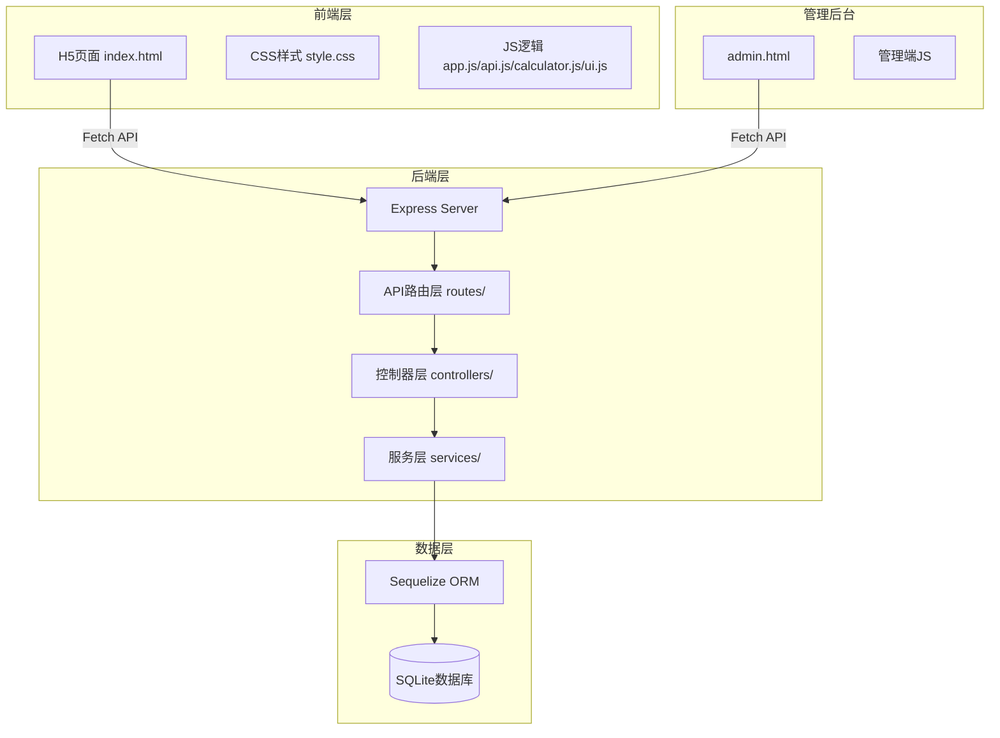
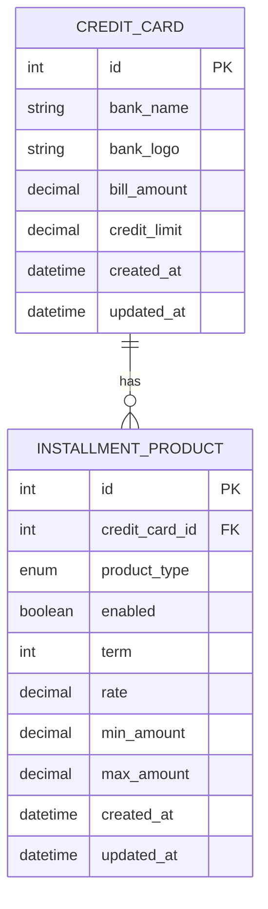

# 信用卡借款成本计算器 - 技术文档

## 1. 技术栈选型

基于当前最成熟的技术栈，结合项目需求，选择以下技术方案：

| 类别 | 技术选型 | 版本/说明 | 选型理由 |
|------|----------|-----------|----------|
| **后端框架** | Node.js + Express | LTS版本 | 成熟稳定、生态完善、与现有项目架构一致 |
| **数据库** | SQLite3 | 最新版本 | 轻量级、无需独立数据库服务、适合中小规模数据 |
| **ORM** | Sequelize | v6+ | 成熟的Node.js ORM、支持SQLite、易于维护 |
| **前端技术** | 原生 HTML5/CSS3/ES6+ | 无框架 | 轻量快速、无需构建工具、便于维护 |
| **UI组件库** | 原生实现 + 自定义 | - | 保持简洁、减少依赖 |
| **响应式框架** | CSS Flexbox + Grid + Media Queries | - | 原生支持、性能最佳 |
| **数据交互** | Fetch API | 原生 | 现代浏览器原生支持 |
| **开发工具** | nodemon | - | 开发时自动重启服务 |

---

## 2. 项目架构设计

### 2.1 整体架构



### 2.2 目录结构

```
credit-calculator/
├── PRD.md                         # 产品需求文档
├── 技术文档.md                     # 本文档
│
├── frontend/                      # 前端H5页面
│   ├── index.html                # 主页面
│   ├── css/
│   │   └── style.css             # 样式文件
│   └── js/
│       ├── app.js                # 主应用入口
│       ├── calculator.js         # 计算引擎
│       ├── api.js                # API接口封装
│       └── ui.js                 # UI交互逻辑
│
├── backend/                       # 后端服务
│   ├── package.json              # 依赖配置
│   ├── server.js                 # 服务启动文件
│   ├── config/
│   │   └── database.js           # 数据库配置
│   ├── models/
│   │   ├── CreditCard.js         # 信用卡模型
│   │   └── InstallmentProduct.js # 分期产品模型
│   ├── controllers/
│   │   ├── creditCardController.js
│   │   ├── installmentProductController.js
│   │   └── calculatorController.js
│   ├── routes/
│   │   ├── api.js                # API路由总入口
│   │   ├── creditCards.js        # 信用卡路由
│   │   ├── installmentProducts.js # 分期产品路由
│   │   └── calculate.js          # 计算路由
│   ├── services/
│   │   └── calculatorService.js  # 计算服务
│   └── data/
│       └── database.sqlite       # SQLite数据库文件
│
└── admin/                         # 管理后台
    └── admin.html                # 管理页面
```

---

## 3. 数据库设计

### 3.1 ER图



### 3.2 数据库表结构

#### 3.2.1 信用卡表 (credit_cards)

| 字段名 | 类型 | 约束 | 说明 | 示例 |
|--------|------|------|------|------|
| id | INTEGER | PRIMARY KEY AUTOINCREMENT | 主键 | 1 |
| bank_name | VARCHAR(100) | NOT NULL | 银行名称 | 招商银行 |
| bank_logo | VARCHAR(255) | NULL | 银行logo URL | |
| bill_amount | DECIMAL(10,2) | NOT NULL DEFAULT 0 | 账单出账金额 | 15000.00 |
| credit_limit | DECIMAL(10,2) | NOT NULL DEFAULT 0 | 现金授信额度 | 50000.00 |
| created_at | DATETIME | NOT NULL DEFAULT CURRENT_TIMESTAMP | 创建时间 | |
| updated_at | DATETIME | NOT NULL DEFAULT CURRENT_TIMESTAMP | 更新时间 | |

#### 3.2.2 分期产品表 (installment_products)

| 字段名 | 类型 | 约束 | 说明 | 示例 |
|--------|------|------|------|------|
| id | INTEGER | PRIMARY KEY AUTOINCREMENT | 主键 | 1 |
| credit_card_id | INTEGER | NOT NULL REFERENCES credit_cards(id) | 关联信用卡ID | 1 |
| product_type | VARCHAR(20) | NOT NULL CHECK IN ('bill','cash') | 产品类型 | bill |
| enabled | BOOLEAN | NOT NULL DEFAULT 1 | 是否启用 | 1 |
| term | INTEGER | NOT NULL | 期数（月） | 3 |
| rate | DECIMAL(5,4) | NOT NULL | 年化利率 | 0.0450 |
| min_amount | DECIMAL(10,2) | NOT NULL DEFAULT 0 | 最低借款金额 | 1000.00 |
| max_amount | DECIMAL(10,2) | NOT NULL | 最高借款金额 | 50000.00 |
| created_at | DATETIME | NOT NULL DEFAULT CURRENT_TIMESTAMP | 创建时间 | |
| updated_at | DATETIME | NOT NULL DEFAULT CURRENT_TIMESTAMP | 更新时间 | |

### 3.3 Sequelize 模型定义

#### CreditCard.js

```javascript
const { DataTypes } = require('sequelize');

module.exports = (sequelize) => {
  const CreditCard = sequelize.define('CreditCard', {
    id: {
      type: DataTypes.INTEGER,
      primaryKey: true,
      autoIncrement: true
    },
    bankName: {
      type: DataTypes.STRING(100),
      allowNull: false,
      field: 'bank_name'
    },
    bankLogo: {
      type: DataTypes.STRING(255),
      allowNull: true,
      field: 'bank_logo'
    },
    billAmount: {
      type: DataTypes.DECIMAL(10, 2),
      allowNull: false,
      defaultValue: 0,
      field: 'bill_amount'
    },
    creditLimit: {
      type: DataTypes.DECIMAL(10, 2),
      allowNull: false,
      defaultValue: 0,
      field: 'credit_limit'
    }
  }, {
    tableName: 'credit_cards',
    timestamps: true,
    createdAt: 'created_at',
    updatedAt: 'updated_at'
  });

  return CreditCard;
};
```

#### InstallmentProduct.js

```javascript
const { DataTypes } = require('sequelize');

module.exports = (sequelize) => {
  const InstallmentProduct = sequelize.define('InstallmentProduct', {
    id: {
      type: DataTypes.INTEGER,
      primaryKey: true,
      autoIncrement: true
    },
    creditCardId: {
      type: DataTypes.INTEGER,
      allowNull: false,
      field: 'credit_card_id'
    },
    productType: {
      type: DataTypes.ENUM('bill', 'cash'),
      allowNull: false,
      field: 'product_type'
    },
    enabled: {
      type: DataTypes.BOOLEAN,
      allowNull: false,
      defaultValue: true
    },
    term: {
      type: DataTypes.INTEGER,
      allowNull: false
    },
    rate: {
      type: DataTypes.DECIMAL(5, 4),
      allowNull: false
    },
    minAmount: {
      type: DataTypes.DECIMAL(10, 2),
      allowNull: false,
      defaultValue: 0,
      field: 'min_amount'
    },
    maxAmount: {
      type: DataTypes.DECIMAL(10, 2),
      allowNull: false,
      field: 'max_amount'
    }
  }, {
    tableName: 'installment_products',
    timestamps: true,
    createdAt: 'created_at',
    updatedAt: 'updated_at'
  });

  return InstallmentProduct;
};
```

#### 模型关联

```javascript
// 在 models/index.js 中
CreditCard.hasMany(InstallmentProduct, {
  foreignKey: 'creditCardId',
  as: 'products'
});

InstallmentProduct.belongsTo(CreditCard, {
  foreignKey: 'creditCardId',
  as: 'creditCard'
});
```

---

## 4. API 接口设计

### 4.1 统一响应格式

```json
{
  "code": 0,
  "message": "success",
  "data": {}
}
```

| 字段 | 类型 | 说明 |
|------|------|------|
| code | int | 状态码，0表示成功，非0表示错误 |
| message | string | 响应消息 |
| data | object/array | 响应数据 |

### 4.2 信用卡管理 API

#### 4.2.1 获取所有信用卡

```
GET /api/credit-cards
```

**响应示例**:

```json
{
  "code": 0,
  "message": "success",
  "data": [
    {
      "id": 1,
      "bankName": "招商银行",
      "bankLogo": "",
      "billAmount": 15000.00,
      "creditLimit": 50000.00,
      "products": [
        {
          "id": 1,
          "productType": "bill",
          "enabled": true,
          "term": 3,
          "rate": 0.0450,
          "minAmount": 1000.00,
          "maxAmount": 50000.00
        }
      ]
    }
  ]
}
```

#### 4.2.2 获取单个信用卡详情

```
GET /api/credit-cards/:id
```

#### 4.2.3 创建信用卡

```
POST /api/credit-cards
```

**请求体**:

```json
{
  "bankName": "招商银行",
  "bankLogo": "",
  "billAmount": 15000.00,
  "creditLimit": 50000.00
}
```

#### 4.2.4 更新信用卡

```
PUT /api/credit-cards/:id
```

**请求体**: 同创建

#### 4.2.5 删除信用卡

```
DELETE /api/credit-cards/:id
```

### 4.3 分期产品管理 API

#### 4.3.1 获取分期产品列表

```
GET /api/credit-cards/:creditCardId/products
```

#### 4.3.2 创建分期产品

```
POST /api/credit-cards/:creditCardId/products
```

**请求体**:

```json
{
  "productType": "bill",
  "enabled": true,
  "term": 3,
  "rate": 0.0450,
  "minAmount": 1000.00,
  "maxAmount": 50000.00
}
```

#### 4.3.3 更新分期产品

```
PUT /api/installment-products/:id
```

#### 4.3.4 删除分期产品

```
DELETE /api/installment-products/:id
```

### 4.4 计算 API

#### 4.4.1 计算最优方案

```
POST /api/calculate
```

**请求体**:

```json
{
  "amount": 20000,
  "minTerm": 3,
  "maxTerm": 12
}
```

**响应示例**:

```json
{
  "code": 0,
  "message": "success",
  "data": {
    "bestOption": {
      "creditCardId": 1,
      "bankName": "招商银行",
      "productType": "bill",
      "productTypeName": "账单分期",
      "term": 6,
      "rate": 0.042,
      "monthlyPayment": 3415.03,
      "totalInterest": 490.18,
      "totalCost": 490.18
    },
    "allOptions": [
      // 所有符合条件的方案列表
    ]
  }
}
```

---

## 5. 核心算法实现

### 5.1 等本等息还款计算

#### 5.1.1 计算公式

```javascript
/**
 * 计算等本等息还款
 * @param {number} principal - 借款本金
 * @param {number} annualRate - 年化利率（小数形式，如 0.045）
 * @param {number} term - 期数（月）
 * @returns {Object} 计算结果
 */
function calculateEqualPayment(principal, annualRate, term) {
  const monthlyRate = annualRate / 12;
  
  // 每月还款额 = (本金 × 月利率 × (1 + 月利率)^期数) / ((1 + 月利率)^期数 - 1)
  const monthlyPayment = principal * monthlyRate * Math.pow(1 + monthlyRate, term) / 
                         (Math.pow(1 + monthlyRate, term) - 1);
  
  // 总还款额
  const totalPayment = monthlyPayment * term;
  
  // 总利息
  const totalInterest = totalPayment - principal;
  
  return {
    principal,
    annualRate,
    term,
    monthlyRate,
    monthlyPayment: Math.round(monthlyPayment * 100) / 100,
    totalPayment: Math.round(totalPayment * 100) / 100,
    totalInterest: Math.round(totalInterest * 100) / 100,
    totalCost: Math.round(totalInterest * 100) / 100
  };
}
```

### 5.2 最优方案筛选算法

```javascript
/**
 * 筛选最优借款方案（支持多家银行组合）
 * @param {Array} creditCards - 信用卡列表
 * @param {number} needAmount - 需要借款的总金额
 * @param {number} minTerm - 最小期数
 * @param {number} maxTerm - 最大期数
 * @returns {Object} 最优方案组合及汇总信息
 */
function findBestOption(creditCards, needAmount, minTerm, maxTerm) {
  // 1. 筛选符合期数条件的所有产品
  const validProducts = [];
  for (const card of creditCards) {
    for (const product of card.products) {
      if (!product.enabled) continue;
      
      // 检查期数范围
      if (product.term < minTerm || product.term > maxTerm) continue;
      
      validProducts.push({
        ...product,
        creditCardId: card.id,
        bankName: card.bankName
      });
    }
  }
  
  // 2. 按年化利率从低到高排序
  validProducts.sort((a, b) => a.rate - b.rate);
  
  // 3. 依次匹配，凑够总借款金额
  let remainingAmount = needAmount;
  const selectedOptions = [];
  
  for (const product of validProducts) {
    if (remainingAmount <= 0) break;
    
    // 确定该产品可借的金额
    let borrowAmount = 0;
    if (product.productType === 'bill') {
      // 账单分期：只能借固定的账单金额
      borrowAmount = Math.min(product.billAmount, remainingAmount);
    } else {
      // 现金分期：可以在 minAmount ~ maxAmount 范围内借
      borrowAmount = Math.min(product.maxAmount, remainingAmount);
      // 不低于最低借款金额
      if (borrowAmount < product.minAmount) {
        continue;
      }
    }
    
    if (borrowAmount <= 0) continue;
    
    // 计算该产品的成本
    const costResult = calculateEqualPayment(borrowAmount, product.rate, product.term);
    
    selectedOptions.push({
      creditCardId: product.creditCardId,
      bankName: product.bankName,
      productType: product.productType,
      productTypeName: product.productType === 'bill' ? '账单分期' : '现金分期',
      term: product.term,
      rate: product.rate,
      borrowAmount: borrowAmount,
      ...costResult
    });
    
    remainingAmount -= borrowAmount;
  }
  
  // 4. 计算汇总信息
  let totalBorrowAmount = 0;
  let totalInterest = 0;
  let totalMonthlyPayment = 0;
  let weightedRateSum = 0;
  
  for (const option of selectedOptions) {
    totalBorrowAmount += option.borrowAmount;
    totalInterest += option.totalInterest;
    totalMonthlyPayment += option.monthlyPayment;
    weightedRateSum += option.rate * option.borrowAmount;
  }
  
  const weightedRate = totalBorrowAmount > 0 ? weightedRateSum / totalBorrowAmount : 0;
  
  return {
    options: selectedOptions,
    total: {
      borrowAmount: totalBorrowAmount,
      weightedRate: weightedRate,
      totalInterest: totalInterest,
      totalMonthlyPayment: totalMonthlyPayment
    }
  };
}
```

### 5.3 一键填入账单总额

```javascript
/**
 * 计算所有信用卡账单出账金额的总和
 * @param {Array} creditCards - 信用卡列表
 * @returns {number} 账单总额
 */
function calculateTotalBillAmount(creditCards) {
  return creditCards.reduce((sum, card) => sum + Number(card.billAmount), 0);
}
```

---

## 6. 前端架构设计

### 6.1 API 封装 (api.js)

```javascript
const API_BASE = '/api';

class ApiClient {
  constructor(baseUrl = API_BASE) {
    this.baseUrl = baseUrl;
  }
  
  async request(endpoint, options = {}) {
    const url = `${this.baseUrl}${endpoint}`;
    const config = {
      headers: {
        'Content-Type': 'application/json',
        ...options.headers
      },
      ...options
    };
    
    try {
      const response = await fetch(url, config);
      const data = await response.json();
      
      if (data.code !== 0) {
        throw new Error(data.message || '请求失败');
      }
      
      return data.data;
    } catch (error) {
      console.error('API Error:', error);
      throw error;
    }
  }
  
  // 信用卡相关
  async getCreditCards() {
    return this.request('/credit-cards');
  }
  
  async getCreditCard(id) {
    return this.request(`/credit-cards/${id}`);
  }
  
  async createCreditCard(data) {
    return this.request('/credit-cards', {
      method: 'POST',
      body: JSON.stringify(data)
    });
  }
  
  async updateCreditCard(id, data) {
    return this.request(`/credit-cards/${id}`, {
      method: 'PUT',
      body: JSON.stringify(data)
    });
  }
  
  async deleteCreditCard(id) {
    return this.request(`/credit-cards/${id}`, {
      method: 'DELETE'
    });
  }
  
  // 计算相关
  async calculate(amount, minTerm, maxTerm) {
    return this.request('/calculate', {
      method: 'POST',
      body: JSON.stringify({ amount, minTerm, maxTerm })
    });
  }
}

export const api = new ApiClient();
```

### 6.2 前端状态管理

```javascript
// app.js
const AppState = {
  creditCards: [],
  currentTab: 'cards', // 'cards' | 'calculate'
  calculateResult: null,
  loading: false
};

class App {
  constructor() {
    this.state = { ...AppState };
    this.init();
  }
  
  async init() {
    await this.loadCreditCards();
    this.bindEvents();
    this.render();
  }
  
  async loadCreditCards() {
    try {
      this.state.loading = true;
      this.state.creditCards = await api.getCreditCards();
    } catch (error) {
      console.error('加载信用卡数据失败:', error);
    } finally {
      this.state.loading = false;
    }
  }
  
  switchTab(tab) {
    this.state.currentTab = tab;
    this.render();
  }
  
  async handleCalculate(amount, minTerm, maxTerm) {
    try {
      this.state.loading = true;
      this.state.calculateResult = await api.calculate(amount, minTerm, maxTerm);
      this.render();
    } catch (error) {
      console.error('计算失败:', error);
    } finally {
      this.state.loading = false;
    }
  }
  
  getTotalBillAmount() {
    return this.state.creditCards.reduce((sum, card) => sum + Number(card.billAmount), 0);
  }
  
  bindEvents() {
    // Tab 切换
    document.querySelectorAll('.tab-btn').forEach(btn => {
      btn.addEventListener('click', () => {
        this.switchTab(btn.dataset.tab);
      });
    });
    
    // 计算按钮
    document.getElementById('calculate-btn')?.addEventListener('click', () => {
      const amount = parseFloat(document.getElementById('amount-input').value);
      const minTerm = parseInt(document.getElementById('min-term-input').value);
      const maxTerm = parseInt(document.getElementById('max-term-input').value);
      this.handleCalculate(amount, minTerm, maxTerm);
    });
    
    // 一键填入按钮
    document.getElementById('fill-bill-btn')?.addEventListener('click', () => {
      const total = this.getTotalBillAmount();
      document.getElementById('amount-input').value = total;
    });
  }
  
  render() {
    this.renderTabs();
    this.renderCardsList();
    this.renderCalculateResult();
  }
  
  renderTabs() {
    document.querySelectorAll('.tab-btn').forEach(btn => {
      btn.classList.toggle('active', btn.dataset.tab === this.state.currentTab);
    });
    document.querySelectorAll('.tab-content').forEach(content => {
      content.classList.toggle('active', content.id === `${this.state.currentTab}-tab`);
    });
  }
  
  renderCardsList() {
    const container = document.getElementById('cards-container');
    if (!container) return;
    
    if (this.state.loading) {
      container.innerHTML = '<div class="loading">加载中...</div>';
      return;
    }
    
    container.innerHTML = this.state.creditCards.map(card => `
      <div class="credit-card">
        <div class="card-header">
          <span class="bank-name">${card.bankName}</span>
        </div>
        <div class="card-body">
          <div class="info-item">
            <span class="label">账单出账金额</span>
            <span class="value bill-amount">¥${card.billAmount.toFixed(2)}</span>
          </div>
          <div class="info-item">
            <span class="label">现金授信额度</span>
            <span class="value credit-limit">¥${card.creditLimit.toFixed(2)}</span>
          </div>
        </div>
      </div>
    `).join('');
  }
  
  renderCalculateResult() {
    const container = document.getElementById('result-container');
    if (!container || !this.state.calculateResult) return;
    
    const { bestOption } = this.state.calculateResult;
    
    if (!bestOption) {
      container.innerHTML = '<div class="no-result">暂无符合条件的方案</div>';
      return;
    }
    
    container.innerHTML = `
      <div class="result-card best-option">
        <div class="result-header">
          <span class="badge">最优方案</span>
          <span class="bank-name">${bestOption.bankName}</span>
        </div>
        <div class="result-body">
          <div class="rate-display">
            <span class="rate-value">${(bestOption.rate * 100).toFixed(2)}%</span>
            <span class="rate-label">年化利率</span>
          </div>
          <div class="details">
            <div class="detail-item">
              <span class="label">产品类型</span>
              <span class="value">${bestOption.productTypeName}</span>
            </div>
            <div class="detail-item">
              <span class="label">借款期限</span>
              <span class="value">${bestOption.term}期</span>
            </div>
            <div class="detail-item">
              <span class="label">每月还款</span>
              <span class="value">¥${bestOption.monthlyPayment.toFixed(2)}</span>
            </div>
            <div class="detail-item">
              <span class="label">总利息</span>
              <span class="value">¥${bestOption.totalInterest.toFixed(2)}</span>
            </div>
          </div>
        </div>
      </div>
    `;
  }
}

// 初始化应用
document.addEventListener('DOMContentLoaded', () => {
  window.app = new App();
});
```

---

## 7. 后端实现

### 7.1 服务启动 (server.js)

```javascript
const express = require('express');
const path = require('path');
const cors = require('cors');

const app = express();
const PORT = process.env.PORT || 3000;

// 中间件
app.use(cors());
app.use(express.json());
app.use(express.static(path.join(__dirname, '../frontend')));
app.use('/admin', express.static(path.join(__dirname, '../admin')));

// 数据库初始化
const { initDatabase } = require('./config/database');
initDatabase();

// API 路由
const apiRoutes = require('./routes/api');
app.use('/api', apiRoutes);

// 启动服务
app.listen(PORT, () => {
  console.log(`服务器运行在 http://localhost:${PORT}`);
});
```

### 7.2 数据库配置 (config/database.js)

```javascript
const { Sequelize } = require('sequelize');
const path = require('path');

const sequelize = new Sequelize({
  dialect: 'sqlite',
  storage: path.join(__dirname, '../data/database.sqlite'),
  logging: false
});

const CreditCard = require('../models/CreditCard')(sequelize);
const InstallmentProduct = require('../models/InstallmentProduct')(sequelize);

// 设置关联
CreditCard.hasMany(InstallmentProduct, {
  foreignKey: 'creditCardId',
  as: 'products'
});
InstallmentProduct.belongsTo(CreditCard, {
  foreignKey: 'creditCardId',
  as: 'creditCard'
});

async function initDatabase() {
  await sequelize.sync({ force: false });
  console.log('数据库初始化完成');
  
  // 插入示例数据
  await seedSampleData();
}

async function seedSampleData() {
  const count = await CreditCard.count();
  if (count > 0) return;
  
  const sampleCards = [
    {
      bankName: '招商银行',
      billAmount: 15000,
      creditLimit: 50000,
      products: [
        { productType: 'bill', term: 3, rate: 0.045, minAmount: 1000, maxAmount: 50000 },
        { productType: 'bill', term: 6, rate: 0.042, minAmount: 1000, maxAmount: 50000 },
        { productType: 'bill', term: 12, rate: 0.048, minAmount: 1000, maxAmount: 50000 },
        { productType: 'cash', term: 3, rate: 0.052, minAmount: 1000, maxAmount: 50000 },
        { productType: 'cash', term: 6, rate: 0.049, minAmount: 1000, maxAmount: 50000 },
        { productType: 'cash', term: 12, rate: 0.055, minAmount: 1000, maxAmount: 50000 }
      ]
    },
    {
      bankName: '工商银行',
      billAmount: 25000,
      creditLimit: 80000,
      products: [
        { productType: 'bill', term: 3, rate: 0.043, minAmount: 1000, maxAmount: 80000 },
        { productType: 'bill', term: 6, rate: 0.040, minAmount: 1000, maxAmount: 80000 },
        { productType: 'cash', term: 3, rate: 0.050, minAmount: 1000, maxAmount: 80000 },
        { productType: 'cash', term: 6, rate: 0.047, minAmount: 1000, maxAmount: 80000 }
      ]
    }
  ];
  
  for (const cardData of sampleCards) {
    const { products, ...cardInfo } = cardData;
    const card = await CreditCard.create(cardInfo);
    
    for (const product of products) {
      await InstallmentProduct.create({
        creditCardId: card.id,
        ...product
      });
    }
  }
  
  console.log('示例数据已插入');
}

module.exports = {
  sequelize,
  CreditCard,
  InstallmentProduct,
  initDatabase
};
```

### 7.3 计算服务 (services/calculatorService.js)

```javascript
const { CreditCard, InstallmentProduct } = require('../config/database');

class CalculatorService {
  static calculateEqualPayment(principal, annualRate, term) {
    const monthlyRate = annualRate / 12;
    const monthlyPayment = principal * monthlyRate * Math.pow(1 + monthlyRate, term) / 
                           (Math.pow(1 + monthlyRate, term) - 1);
    const totalPayment = monthlyPayment * term;
    const totalInterest = totalPayment - principal;
    
    return {
      principal,
      annualRate,
      term,
      monthlyRate,
      monthlyPayment: Math.round(monthlyPayment * 100) / 100,
      totalPayment: Math.round(totalPayment * 100) / 100,
      totalInterest: Math.round(totalInterest * 100) / 100,
      totalCost: Math.round(totalInterest * 100) / 100
    };
  }
  
  static async findBestOption(needAmount, minTerm, maxTerm) {
    const creditCards = await CreditCard.findAll({
      include: [{
        model: InstallmentProduct,
        as: 'products'
      }]
    });
    
    const candidates = [];
    
    for (const card of creditCards) {
      for (const product of card.products) {
        if (!product.enabled) continue;
        
        // 检查金额门槛
        let isAmountValid = false;
        if (product.productType === 'cash') {
          isAmountValid = card.creditLimit >= needAmount;
        } else if (product.productType === 'bill') {
          isAmountValid = card.billAmount >= needAmount;
        }
        
        if (!isAmountValid) continue;
        
        // 检查期数
        if (product.term < minTerm || product.term > maxTerm) continue;
        
        // 检查金额范围
        if (needAmount < product.minAmount || needAmount > product.maxAmount) continue;
        
        // 计算成本
        const costResult = this.calculateEqualPayment(needAmount, product.rate, product.term);
        
        candidates.push({
          creditCardId: card.id,
          bankName: card.bankName,
          productType: product.productType,
          productTypeName: product.productType === 'bill' ? '账单分期' : '现金分期',
          term: product.term,
          rate: product.rate,
          ...costResult
        });
      }
    }
    
    // 按利率排序
    candidates.sort((a, b) => a.rate - b.rate);
    
    return {
      bestOption: candidates.length > 0 ? candidates[0] : null,
      allOptions: candidates
    };
  }
}

module.exports = CalculatorService;
```

---

## 8. 响应式设计实现

### 8.1 视口设置

```html
<meta name="viewport" content="width=device-width, initial-scale=1.0, maximum-scale=1.0, user-scalable=no">
```

### 8.2 CSS 媒体查询

```css
/* 基础样式 - 移动端优先 */
:root {
  --primary-color: #1890ff;
  --success-color: #52c41a;
  --warning-color: #faad14;
  --danger-color: #ff4d4f;
  --text-color: #333;
  --bg-color: #f5f5f5;
  --card-bg: #fff;
  --border-radius: 12px;
}

* {
  margin: 0;
  padding: 0;
  box-sizing: border-box;
}

body {
  font-family: -apple-system, BlinkMacSystemFont, 'Segoe UI', Roboto, 'Helvetica Neue', Arial, sans-serif;
  background-color: var(--bg-color);
  color: var(--text-color);
  min-height: 100vh;
}

.container {
  max-width: 480px;
  margin: 0 auto;
  padding: 16px;
}

/* 平板设备 */
@media (min-width: 768px) {
  .container {
    max-width: 640px;
    padding: 24px;
  }
}

/* 桌面设备 */
@media (min-width: 1024px) {
  .container {
    max-width: 720px;
  }
}
```

---

## 9. 部署说明

### 9.1 环境要求

- Node.js >= 16.x
- npm >= 8.x

### 9.2 本地开发

```bash
# 进入后端目录
cd credit-calculator/backend

# 安装依赖
npm install

# 启动开发服务器
npm run dev
```

### 9.3 生产部署

```bash
# 安装生产依赖
npm install --production

# 使用 PM2 管理进程
npm install -g pm2
pm2 start server.js --name credit-calculator
```

### 9.4 访问地址

- 前端页面: http://localhost:3000
- 管理后台: http://localhost:3000/admin

---

## 10. 开发计划

### 阶段一：后端基础搭建
- [ ] 初始化项目结构
- [ ] 配置数据库和Sequelize
- [ ] 创建数据模型
- [ ] 实现基础CRUD API
- [ ] 插入示例数据

### 阶段二：计算功能实现
- [ ] 实现计算服务
- [ ] 实现计算API
- [ ] 单元测试

### 阶段三：前端页面开发
- [ ] 实现HTML结构
- [ ] 实现CSS样式（响应式）
- [ ] 实现API封装
- [ ] 实现Tab 1 - 信用卡列表
- [ ] 实现Tab 2 - 计算功能（含一键填入按钮）
- [ ] 结果展示

### 阶段四：管理后台
- [ ] 管理后台页面
- [ ] 信用卡管理功能
- [ ] 分期产品管理功能

### 阶段五：测试优化
- [ ] 功能测试
- [ ] 兼容性测试
- [ ] 性能优化
- [ ] 代码整理
